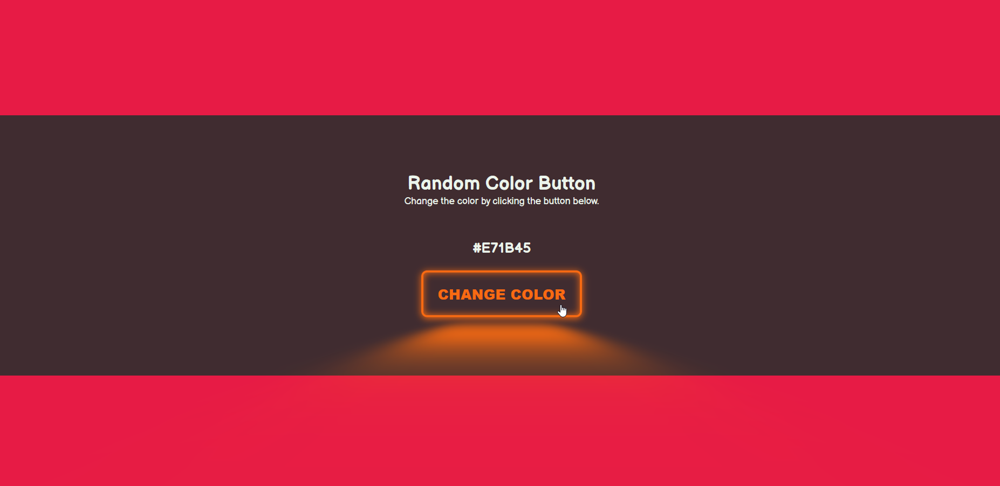

# 🎨 Random Color Generator

> A simple and interactive color generator built using **HTML**, **CSS**, and **JavaScript**.

## 📑 Table of Contents

- [General Info](#general-info)
- [Screenshots](#screenshots)
- [Technologies](#technologies)
- [Setup](#setup)
- [Code Examples](#code-examples)
- [Features](#features)
- [Project Status](#project-status)
- [Inspiration](#inspiration)
- [Contact](#contact)
- [Usage Instructions](#usage-instructions)
- [Code Quality Checks](#code-quality-checks)
- [Continuous Integration (CI)](#continuous-integration-ci)
- [Repository Setup](#repository-setup)

---

## 📋 General Info

This is a simple random color generator that dynamically changes the background
color of the webpage when the button is clicked. It uses **HTML5**, **CSS3**, and
**JavaScript** to practice basic DOM manipulation and event handling.

---

## 🖼️ Screenshots



---

## 💻 Technologies

- HTML5
- CSS3
- JavaScript (Vanilla)
- Node.js (v14.16.0)
- Visual Studio Code (IDE)

---

## Setup

- `npm run start`
- `npm install`

## Code Examples

```js
for (let i = 0; i < 6; i++) {
  const index = Math.floor(Math.random() * 15);
  hexColor += hexData[index];
}
```

## Features

- change the background color.

### To-do list

- N/A

## Status

Project is: done

## Inspiration

Inspired by HYF. The aim is to practice basic DOM manipulation and event handling.

## Contact

By [boba-milktea](https://github.com/boba-milktea)

## Instructions for use

<details>
  <summary>Getting Started</summary>

<!-- a guide to using this repository -->

1. `git clone git@github.com:HackYourFutureBelgium/template-markdown.git`
2. `cd template-markdown`
3. `npm install`

## Code Quality Checks

- `npm run format`: Makes sure all the code in this repository is well-formatted
  (looks good).
- `npm run lint:ls`: Checks to make sure all folder and file names match the
  repository conventions.
- `npm run lint:md`: Will lint all of the Markdown files in this repository.
- `npm run lint:css`: Will lint all of the CSS files in this repository.
- `npm run validate:html`: Validates all HTML files in your project.
- `npm run spell-check`: Goes through all the files in this repository looking
  for words it doesn't recognize. Just because it says something is a mistake
  doesn't mean it is! It doesn't know every word in the world. You can add new
  correct words to the [./.cspell.json](./.cspell.json) file so they won't cause
  an error.
- `npm run accessibility -- ./path/to/file.html`: Runs an accessibility analysis
  on all HTML files in the given path and writes the report to
  `/accessibility_report`

## Continuous Integration (CI)

When you open a PR to `main`/`master` in your repository, GitHub will
automatically do a linting check on the code in this repository, you can see
this in the[./.github/workflows/lint.yml](./.github/workflows/lint.yml) file.

If the linting fails, you will not be able to merge the PR. You can double check
that your code will pass before pushing by running the code quality scripts
locally.

## Repo Setup

- Give each member **_write_** access to the repo (if it's a group project)
- Turn on GitHub Pages and put a link to your website in the repo's description
- Go to _General_ Section > check **Discussions**
- In the _Branches_ section of your repo's settings make sure the
  `master`/`main` branch must:
  - "_Require a pull request before merging_"
  - "_Require approvals_"
  - "_Dismiss stale pull request approvals when new commits are pushed_"
  - "_Require status checks to pass before merging_"
  - "_Require branches to be up to date before merging_"
  - "_Do not allow bypassing the above settings_"

</details>
